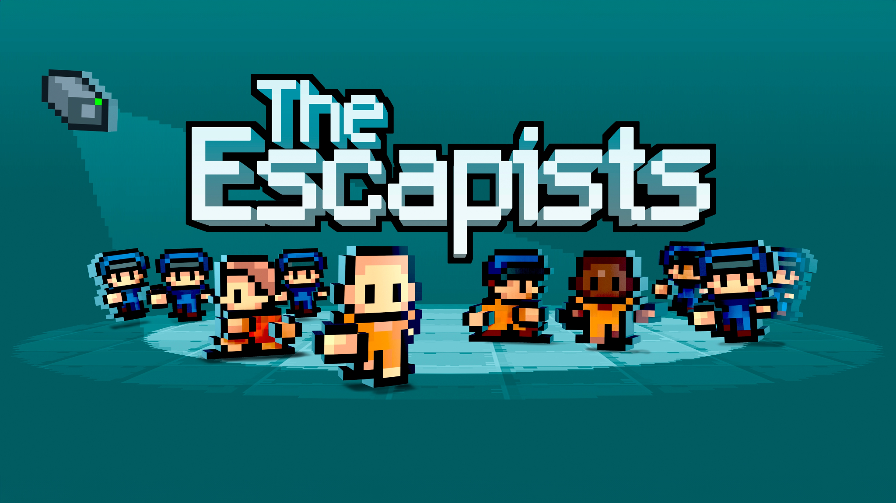
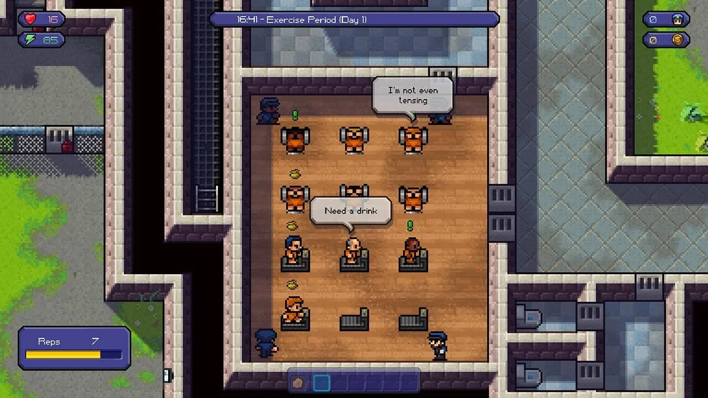

<p align="center">
  
</p>

<h1 align="center">The Escapists — PortMaster</h1>

<p align="center">
  
  
  
  
  
</p>

<p align="center">
  <a href="#portugues"></a>
  <a href="#english"></a>
</p>

<p align="center">
  <strong>⚠️ PORT EM FASE DE TESTES / PORT CURRENTLY IN TESTING ⚠️</strong>
</p>

<a id="portugues"></a>

# 🇧🇷 Português

Um port não oficial de **The Escapists** para PortMaster, baseado na versão oficial do jogo para Linux. O jogo é executado em portáteis ARM através do **Box64** e do **WestonPack**.

O port já inicia no **R36S com ArkOS**, mas ainda está em desenvolvimento. Recursos, desempenho, compatibilidade e configuração podem mudar durante os testes.

> **BYO-data:** este repositório não inclui o jogo nem arquivos protegidos. Você deve fornecer sua própria cópia legal da versão Linux de The Escapists.

## Sobre o jogo

**The Escapists** é um jogo de estratégia e simulação no qual você vive a rotina de um prisioneiro enquanto planeja sua fuga. Siga os horários da prisão, cumpra tarefas, consiga itens, crie ferramentas, melhore suas habilidades e encontre uma maneira de escapar sem levantar suspeitas.

O jogo original foi desenvolvido pela **Mouldy Toof Studios** e publicado pela **Team17**.

<p align="center">
  
  <br>
  <sub>Captura de gameplay de The Escapists.</sub>
</p>

## Estado atual do port

- O jogo inicia no R36S com ArkOS
- Resolução adaptada para a tela do portátil
- Execução da versão Linux através do Box64
- Ambiente gráfico fornecido pelo WestonPack
- Saída segura para o menu do sistema funcionando
- Desempenho, interface e integração com o portátil ainda em avaliação
- Mapeamento inicial dos controles disponível e ainda em ajustes
- Compatibilidade com outros aparelhos ainda não confirmada

## Requisitos

- Um portátil ARM compatível com PortMaster
- PortMaster instalado e atualizado
- WestonPack disponível no sistema
- Uma cópia legal da versão Linux de **The Escapists**
- Espaço livre suficiente para o port e os arquivos do jogo

## Controles

| Controle | Função |
| --- | --- |
| **Analógico esquerdo** | Movimenta o personagem |
| **Analógico direito** | Movimenta o cursor do mouse |
| **D-Pad para baixo** | Abre o menu de criação (Craft) |
| **D-Pad para cima** | Abre os itens equipados |
| **R1** | Interage com os personagens |
| **R1 / L1** | Interagem com os aparelhos da academia |
| **R2 / L2** | Alternam os itens na mochila |
| **Y** | Entra no modo de ataque |
| **B** | Pega itens |
| **A** | Interage com itens |

> **Atenção:** para usar **A** ou **B**, posicione primeiro o cursor do mouse sobre o objeto desejado.

## Instalação para testes

> Estas instruções são provisórias e poderão mudar antes do lançamento estável.

1. Baixe a versão de testes mais recente na seção **Releases** do repositório.
2. Extraia o pacote na pasta `ports` do cartão SD.
3. Copie os arquivos da sua versão Linux legalmente obtida para a pasta `gamedata` incluída no port.
4. Ejete o cartão SD com segurança e coloque-o no portátil.
5. Abra **The Escapists** na seção Ports.

Estrutura esperada:

```text
ports/
├── theescapists/
│   ├── gamedata/
│   │   └── arquivos da versão Linux
│   ├── box64/
│   └── demais arquivos do port
└── The Escapists.sh
```

Não envie arquivos originais do jogo em Issues, commits ou Releases.

## Compatibilidade

| Aparelho / sistema | Situação |
| --- | --- |
| R36S + ArkOS | Em testes |
| RK3326 + Mali-G31 MP2 | Em testes |
| Outros aparelhos com PortMaster | Ainda não confirmado |

Os resultados podem variar conforme a versão do sistema, do PortMaster, do WestonPack e dos arquivos do jogo.

## Problemas conhecidos

- O mapeamento para controles de portátil ainda está sendo ajustado
- Alguns elementos da interface ainda podem precisar de adaptação
- O desempenho pode variar conforme o aparelho
- Algumas funções podem exigir teclado ou cursor durante os testes
- O port ainda não deve ser considerado uma versão final

## Como ajudar nos testes

Ao reportar um problema, informe:

- modelo do aparelho;
- sistema utilizado;
- versão do PortMaster;
- em que momento o problema acontece;
- arquivo de log completo, quando disponível.

Não anexe executáveis, assets ou outros arquivos originais do jogo.

## Créditos

- **Mouldy Toof Studios** — jogo original
- **Team17** — publicação do jogo
- **Desenvolvedores do Box64** — camada de compatibilidade
- **Comunidade PortMaster** — plataforma, ferramentas e documentação
- **Comunidade WestonPack** — ambiente gráfico para ports Linux
- **Lucas Soares** — adaptação e configuração do port

## Licença

Os scripts, configurações, patches e documentos originais criados especificamente para este port são disponibilizados sob a [Licença MIT](LICENSE), salvo indicação diferente em algum arquivo.

A licença aplica-se somente ao trabalho original deste projeto. Ela não se aplica ao jogo, executáveis, assets, músicas, marcas, Box64, WestonPack ou bibliotecas de terceiros.

As imagens exibidas neste README são usadas apenas para identificar e demonstrar o jogo. Elas pertencem aos seus respectivos proprietários e **não estão cobertas pela Licença MIT** deste projeto.

## Aviso legal

Este é um projeto de compatibilidade não oficial, criado por fãs. Não possui afiliação, patrocínio, aprovação ou endosso da Mouldy Toof Studios ou da Team17.

Todos os nomes, marcas, códigos, artes, áudios e assets do jogo pertencem aos respectivos proprietários. Apoie os desenvolvedores adquirindo o jogo legalmente.

<p align="right"><a href="#english">Go to English →</a></p>

---

<a id="english"></a>

# 🇺🇸 English

An unofficial PortMaster port of **The Escapists**, based on the official Linux release. The game runs on ARM handhelds through **Box64** and **WestonPack**.

The port currently launches on the **R36S with ArkOS**, but it is still under development. Features, performance, compatibility, and configuration may change during testing.

> **BYO-data:** this repository does not include the game or any copyrighted game files. You must provide your own legally obtained Linux copy of The Escapists.

## About the game

**The Escapists** is a strategy and simulation game in which you follow the daily routine of a prisoner while planning your escape. Follow the prison schedule, complete jobs, collect items, craft tools, improve your skills, and find a way out without raising suspicion.

The original game was developed by **Mouldy Toof Studios** and published by **Team17**.

<p align="center">
  
  <br>
  <sub>The Escapists gameplay screenshot.</sub>
</p>

## Current port status

- The game launches on the R36S with ArkOS
- Resolution adapted for the handheld display
- Official Linux release running through Box64
- Graphical environment provided by WestonPack
- Safe exit back to the system menu is working
- Performance, interface, and handheld integration are still being evaluated
- Initial controller mapping is available and still being adjusted
- Compatibility with other devices has not yet been confirmed

## Requirements

- An ARM handheld compatible with PortMaster
- PortMaster installed and updated
- WestonPack available on the system
- A legally obtained Linux copy of **The Escapists**
- Enough free storage for the port and game files

## Controls

| Control | Function |
| --- | --- |
| **Left analog stick** | Moves the character |
| **Right analog stick** | Moves the mouse cursor |
| **D-Pad Down** | Opens the Craft menu |
| **D-Pad Up** | Opens the equipped items |
| **R1** | Interacts with characters |
| **R1 / L1** | Interact with the gym equipment |
| **R2 / L2** | Cycle through backpack items |
| **Y** | Enters attack mode |
| **B** | Picks up items |
| **A** | Interacts with items |

> **Important:** before using **A** or **B**, position the mouse cursor over the desired object.

## Test installation

> These instructions are temporary and may change before the stable release.

1. Download the latest test build from the repository's **Releases** section.
2. Extract the package into the `ports` directory on your SD card.
3. Copy the files from your legally obtained Linux release into the port's included `gamedata` directory.
4. Safely eject the SD card and insert it into your handheld.
5. Start **The Escapists** from the Ports section.

Expected structure:

```text
ports/
├── theescapists/
│   ├── gamedata/
│   │   └── Linux game files
│   ├── box64/
│   └── other port files
└── The Escapists.sh
```

Do not upload original game files to Issues, commits, or Releases.

## Compatibility

| Device / system | Status |
| --- | --- |
| R36S + ArkOS | Testing |
| RK3326 + Mali-G31 MP2 | Testing |
| Other PortMaster devices | Not yet confirmed |

Results may vary depending on the system, PortMaster, WestonPack, and game file versions.

## Known issues

- Handheld controller mapping is still being adjusted
- Some interface elements may still require adaptation
- Performance may vary between devices
- Some features may require a keyboard or cursor during testing
- The port should not yet be considered a final release

## Helping with testing

When reporting an issue, include:

- device model;
- operating system;
- PortMaster version;
- when the problem occurs;
- complete log file, when available.

Do not attach original game executables, assets, or other copyrighted files.

## Credits

- **Mouldy Toof Studios** — original game
- **Team17** — game publisher
- **Box64 developers** — compatibility layer
- **PortMaster community** — platform, tools, and documentation
- **WestonPack community** — graphical environment for Linux ports
- **Lucas Soares** — port adaptation and configuration

## License

Original scripts, configuration files, patches, and documentation created specifically for this port are licensed under the [MIT License](LICENSE), unless stated otherwise in a file.

This license applies only to the original work in this project. It does not apply to the game, executables, assets, music, trademarks, Box64, WestonPack, or third-party libraries.

The images displayed in this README are used only to identify and demonstrate the game. They belong to their respective owners and are **not covered by this project's MIT License**.

## Legal notice

This is an unofficial, fan-made compatibility project. It is not affiliated with, sponsored by, approved by, or endorsed by Mouldy Toof Studios or Team17.

All game names, trademarks, code, artwork, audio, and assets belong to their respective owners. Support the developers by obtaining the game legally.

<p align="right"><a href="#portugues">← Voltar ao Português</a></p>
